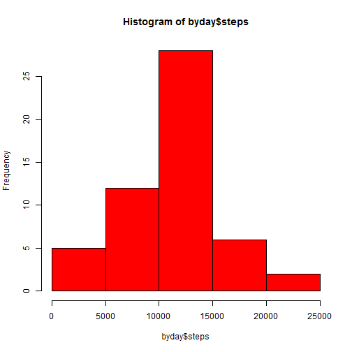
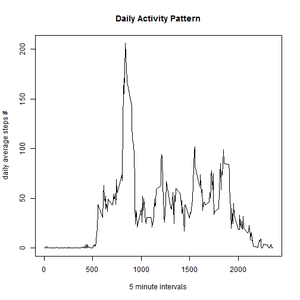
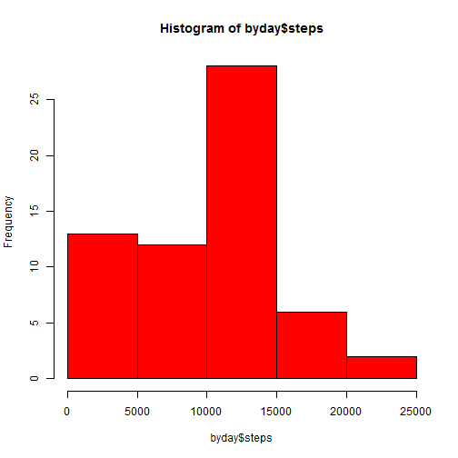
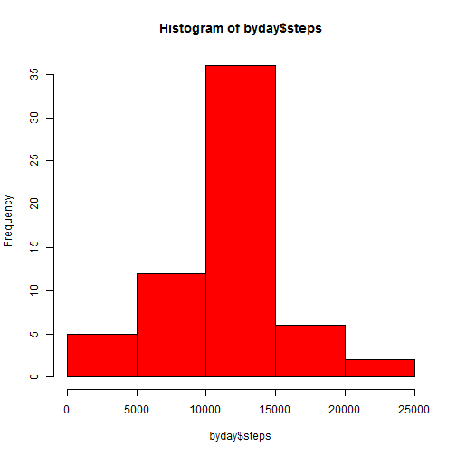
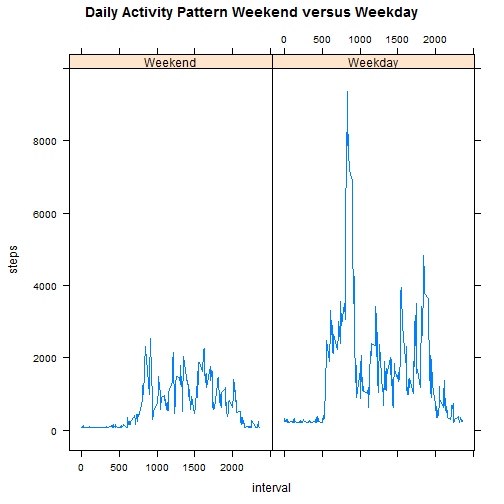

# Reproducible Research: Peer Assessment 1


## Loading and preprocessing the data

```r
data <- read.table(unzip("activity.zip"), sep=",", head=TRUE)
str(data)
```

```
## 'data.frame':	17568 obs. of  3 variables:
##  $ steps   : int  NA NA NA NA NA NA NA NA NA NA ...
##  $ date    : Factor w/ 61 levels "2012-10-01","2012-10-02",..: 1 1 1 1 1 1 1 1 1 1 ...
##  $ interval: int  0 5 10 15 20 25 30 35 40 45 ...
```

```r
library(sqldf)
```

```
## Loading required package: gsubfn
## Loading required package: proto
## Loading required package: RSQLite
## Loading required package: DBI
## Loading required package: RSQLite.extfuns
```

```r
byday <- sqldf("select date, sum(steps) as steps from data group by date ")
```

```
## Loading required package: tcltk
```

```r
str(byday)
```

```
## 'data.frame':	61 obs. of  2 variables:
##  $ date : Factor w/ 61 levels "2012-10-01","2012-10-02",..: 1 2 3 4 5 6 7 8 9 10 ...
##  $ steps: int  NA 126 11352 12116 13294 15420 11015 NA 12811 9900 ...
```

## What is mean total number of steps taken per day?

```r
hist(byday$steps, col="red")
```

 


```r
summary(byday$steps)
```

```
##    Min. 1st Qu.  Median    Mean 3rd Qu.    Max.    NA's 
##      41    8840   10800   10800   13300   21200       8
```

## What is the average daily activity pattern?

```r
byinterval <- sqldf("select interval, avg(steps) steps from data group by interval order by interval")
plot(byinterval, type="l", main = ("Daily Activity Pattern"), xlab = "5 minute intervals", ylab = "daily average steps #")
```

 

This is the interval with the most steps on daily average:

```r
sqldf("select interval from byinterval where steps=(select max(steps) from byinterval)")
```

```
##   interval
## 1      835
```


## Imputing missing values
According to the summary there are 2304 missing values in the steps column:

```r
sum(is.na(data$steps))
```

```
## [1] 2304
```
The strategy would be to use na.rm=TRUE parameters for functions in order to deal with NULL according to the corresponding statistical function. 

Here is another approach overwriting NAs with zero:

```r
data <- read.table(unzip("activity.zip"), sep=",", head=TRUE)
data[is.na(data$steps),]$steps <- 0
byday <- sqldf("select date, sum(steps) as steps from data group by date ")
hist(byday$steps, col="red")
```

 

```r
summary(byday$steps)
```

```
##    Min. 1st Qu.  Median    Mean 3rd Qu.    Max. 
##       0    6780   10400    9350   12800   21200
```
As we can see the sql aggregates and the summary function just remove the rows with missing values. Alternatively we could fill in the mean value instead of 0 to  get more similar values.

```r
data <- read.table(unzip("activity.zip"), sep=",", head=TRUE)
data[is.na(data$steps),]$steps <- mean(data$steps, na.rm=T)
byday <- sqldf("select date, sum(steps) as steps from data group by date ")
hist(byday$steps, col="red")
```

 

```r
summary(byday$steps)
```

```
##    Min. 1st Qu.  Median    Mean 3rd Qu.    Max. 
##      41    9820   10800   10800   12800   21200
```

## Are there differences in activity patterns between weekdays and weekends?

```r
dates <- as.POSIXlt(data$date, format = "%Y-%m-%d")
weekdays <- dates$wday
weekdays[ weekdays == 0] <- 0
weekdays[ weekdays == 6] <- 0
weekdays[ weekdays != 0] <- 1
weekdays <- factor(weekdays, levels = c(0,1), labels=c("Weekend", "Weekday"))
data$W0 <- weekdays
bywday <- sqldf("select w0,interval,sum(steps) as steps from data group by w0,interval")
library(lattice)
xyplot(steps~interval | W0, data=bywday, layout=c(2,1), type="l", main="Daily Activity Pattern Weekend versus Weekday")
```

 
